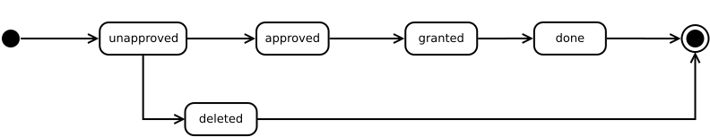

# Ambulancia del deseo

*Por Evelio A. Mora Marín y Javier Izquierdo Roca*

Este proyecto consiste en crear una página web para la **Ambulancia del deseo**, una fundación que se encarga de cumplir los últimos deseos de pacientes estado terminal.

## Modelo

Hemos diseñado el siguiente Diagrama Entidad-Relación para modelar los datos de nuestro sistema.

Como vemos tenemos un booleano que define los roles de cada usuario esto nos permite que un usuario tenga varios roles sin necesidad de tablas intermedias que nos cmpliquen mucho el modelo.

## Deseos

Los deseos son el corazón de la página y todo va orientado a estos. Para ello hemos diseñado el siguiente ciclo de vida.

1. El deseo comienza cuando un **solicitante** lo solicita insertando el **paciente**, los **datos del paciente** y el **deseo**. Una vez hecho esto se crea el deseo y pasa al estado *unapproved* esperando a que un **administrador** lo apruebe o lo rechace, borrándolo.

2. El **administrador** aprueba el deseo que pasa a estado *approved*. En este estado el **administrador** deberá asignar recursos (**voluntarios**) al deseo comprobando las fechas en que están disponibles.

3. Una vez el **administrador** asigna los recursos el deseo pasa a estar *granted* a la espera de que se cumpla en la fecha programada.

4. Cuando el deseo se ha llevado a cabo el **administrador** puede marcarlo como finalizado y pasa a estado *done* finalizando el ciclo de vida del deseo.

## Papeles de los distintos usuarios

En esta página contamos con 3 tipos de usuarios:

* **Administrador**: es responsable de controlar el ciclo de vida de los deseos y controla los privilegios de los ususarios.

* **Voluntario**: introduce las horas que tiene disponibles para ayudar con deseos.

* **Solicitante**: es quien solicita los deseos para él o un tercero.