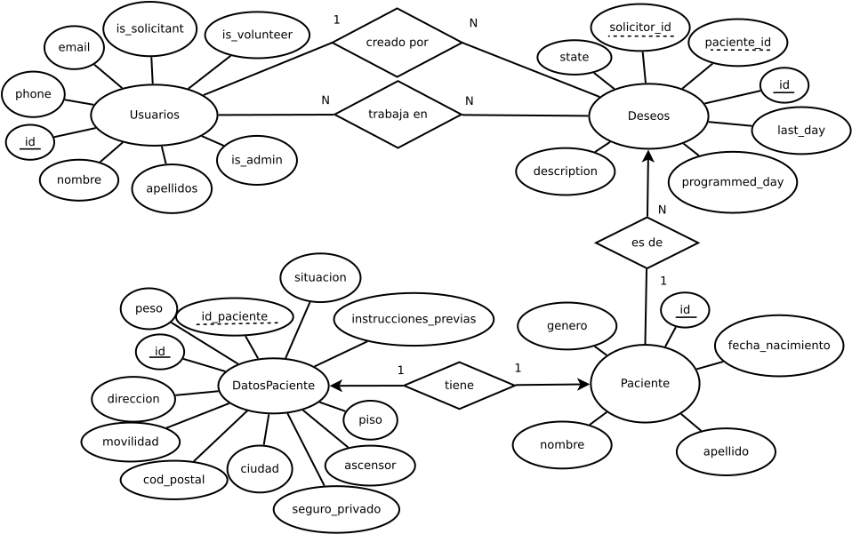

# Ambulancia del deseo

*Por Evelio A. Mora Marín y Javier Izquierdo Roca*

Este proyecto consiste en crear una página web para la **Ambulancia del deseo**, una fundación que se encarga de cumplir los últimos deseos de pacientes estado terminal.

## Modelo

Hemos diseñado el siguiente Diagrama Entidad-Relación para modelar los datos de nuestro sistema.

Como vemos tenemos un booleano que define los roles de cada usuario esto nos permite que un usuario tenga varios roles sin necesidad de tablas intermedias que nos cmpliquen mucho el modelo.